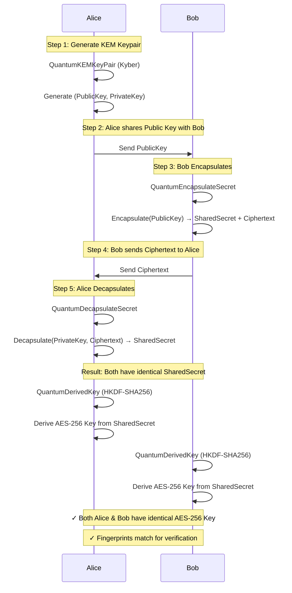

# QubeSec

<div align="center">
  
</div>

A Kubernetes operator for post-quantum cryptography providing custom resource definitions (CRDs) and controllers for quantum-safe key generation, key encapsulation, key derivation, and certificate management.

## Overview

QubeSec leverages [liboqs](https://github.com/open-quantum-safe/liboqs) and [OpenSSL with oqs-provider](https://github.com/open-quantum-safe/oqs-provider) to integrate post-quantum cryptographic algorithms into Kubernetes. All cryptographic operations are automated through custom controllers that orchestrate the NIST-standardized quantum-safe algorithms (Kyber, Dilithium, etc.).

## Key Features

- **Quantum-Safe Key Generation**: Generate Kyber KEM keypairs and Dilithium signature keypairs
- **Key Encapsulation**: Derive shared secrets using KEM encapsulation from public keys
- **Key Decapsulation**: Recover shared secrets using KEM decapsulation with private key and ciphertext
- **Key Derivation**: Generate AES-256 keys from shared secrets using HKDF-SHA256
- **Quantum Certificates**: Create X.509 certificates with post-quantum algorithms
- **Secure Secret Storage**: All keys stored as raw binary data in Kubernetes Secrets
- **Key Fingerprinting**: SHA256 fingerprints generated for shared secrets (encap/decap) and derived keys for verification and audit
- **Ciphertext Bridging**: Decapsulation can pull ciphertext directly from a referenced QuantumEncapsulateSecret status (or via inline spec.ciphertext)
- **Automated Workflows**: Chainable controllers (KEM → Shared Secret → Derived Key)

## Supported Algorithms

- **Key Encapsulation**: Kyber (NIST-standardized post-quantum KEM)
- **Signature**: Dilithium (NIST-standardized post-quantum signature algorithm)
- **Random Generation**: Go's `crypto/rand` with cryptographically secure randomness

## Architecture

### Quantum-Safe Key Exchange between Alice and Bob



### Workflow Example: Complete Quantum-Safe Key Exchange

```
1. QuantumKEMKeyPair
   ├─ Generates Kyber (ML-KEM-1024) keypair
   └─ Stored in Kubernetes Secret

2. QuantumEncapsulateSecret
   ├─ Uses public key to encapsulate
   ├─ Generates shared secret + ciphertext
   └─ Stored in Kubernetes Secret

3. QuantumDecapsulateSecret (Optional - for verification)
   ├─ Uses private key + ciphertext (inline `spec.ciphertext` or auto-fetched via `spec.ciphertextRef` from QuantumEncapsulateSecret status)
   ├─ Recovers the same shared secret
   └─ Validates correctness of encapsulation/decapsulation

4. QuantumDerivedKey
   ├─ Uses shared secret (from either source)
   ├─ Derives AES-256 key via HKDF-SHA256
   ├─ Both sources produce identical derived keys
   └─ Stored in Kubernetes Secret
```

**Key Verification**: If you encapsulate and decapsulate using the same keypair and ciphertext, both sources will produce identical derived keys (same fingerprint). This verifies the correctness of your quantum-safe key exchange.

All intermediate results are stored in Kubernetes Secrets for consumption by other workloads.

## Custom Resources

| Abbreviation | Resource | Purpose |
|---|---|---|
| `qrn` | QuantumRandomNumber | Generate cryptographically secure random bytes |
| `qkkp` | QuantumKEMKeyPair | Generate Kyber KEM public/private keypairs |
| `qes` | QuantumEncapsulateSecret | Derive shared secrets via KEM encapsulation from public key |
| `qds` | QuantumDecapsulateSecret | Recover shared secrets via KEM decapsulation using private key + ciphertext |
| `qdk` | QuantumDerivedKey | Derive AES-256 keys from shared secrets using HKDF-SHA256 |
| `qskp` | QuantumSignatureKeyPair | Generate Dilithium signature keypairs |
| `qc` | QuantumCertificate | Create X.509 certificates with quantum algorithms |

## Key Storage Format

All cryptographic keys (keypairs, certificates, derived keys, shared secrets, random numbers) are stored in Kubernetes Secrets in raw binary data format. This ensures secure and efficient storage.

### Fingerprints (Shared Secrets & Derived Keys)

- **Encapsulate / Decapsulate**: Both `QuantumEncapsulateSecret` and `QuantumDecapsulateSecret` compute a SHA256 fingerprint of the shared secret (first 10 hex chars) and expose it in `.status.fingerprint` and kubectl printer columns.
- **Derived Keys**: `QuantumDerivedKey` also fingerprints the derived key for audit/verification.
- **Usage**: Compare fingerprints across resources to confirm the same shared secret and derived key were produced without revealing key material.

Fingerprints are hex-encoded for readability. See [SETUP.md - Key Storage and Retrieval](SETUP.md#key-storage-and-retrieval) for retrieval examples.

## Getting Started

### Quick Install (Kubernetes)

Install QubeSec operator and all CRDs with a single command:

```bash
kubectl apply -f https://raw.githubusercontent.com/QubeSec/QubeSec/main/dist/install.yaml
```

Verify installation:

```bash
kubectl get pods -n qubesec-system
kubectl get crd | grep qubesec
```

Create your first quantum resource:

```bash
kubectl apply -f https://raw.githubusercontent.com/QubeSec/QubeSec/main/config/samples/_v1_quantumrandomnumber.yaml
kubectl get qrn
```

### Development Setup with Ansible

```bash
cd ansible
ansible-playbook setup-liboqs.yml
```

This automates installation of liboqs, OpenSSL with oqs-provider, and Go bindings to `/opt/`.

### Manual Setup

For step-by-step instructions, environment variable configuration, and command reference, see [SETUP.md](SETUP.md).

## Infrastructure Setup

## Development

See [SETUP.md](SETUP.md) for:
- Kubebuilder initialization and API generation
- CRD installation and testing
- Local development and debugging
- Docker image building and deployment

## Documentation

- [SETUP.md](SETUP.md) - Complete installation and operation guide
- [api/v1/](api/v1/) - Custom Resource Definitions
