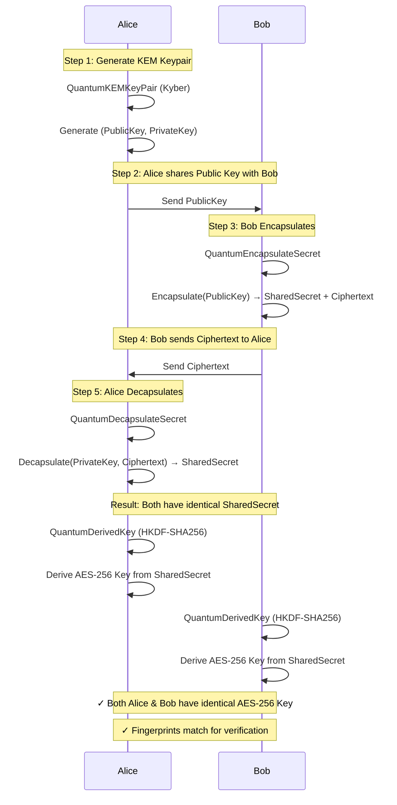
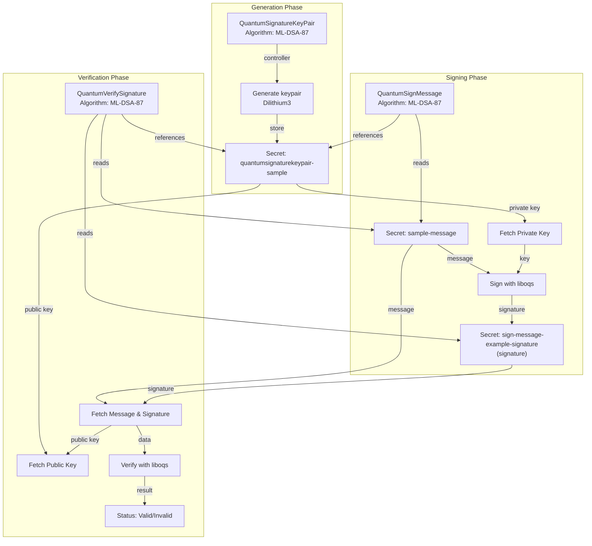

# QubeSec Architecture

This document describes the architectural design of QubeSec, including data flows, component interactions, and detailed sequence diagrams for quantum-safe cryptographic operations.

## Table of Contents

1. [Overview](#overview)
2. [System Components](#system-components)
   - [Kubernetes Custom Resources](#kubernetes-custom-resources)
   - [Controller Components](#controller-components)
3. [Quantum-Safe Key Exchange](#quantum-safe-key-exchange)
4. [Quantum Signatures](#quantum-signatures)
5. [Key Storage and Fingerprinting](#key-storage-and-fingerprinting)
6. [Resource Relationships](#resource-relationships)
7. [Data Flow Patterns](#data-flow-patterns)
8. [Security Considerations](#security-considerations)
9. [Performance and Scalability](#performance-and-scalability)
10. [Future Enhancements](#future-enhancements)

## Overview

QubeSec is a Kubernetes operator that provides quantum-safe cryptographic operations through custom resources. It leverages [liboqs](https://github.com/open-quantum-safe/liboqs) and [OpenSSL with oqs-provider](https://github.com/open-quantum-safe/oqs-provider) to integrate NIST-standardized post-quantum cryptographic algorithms into Kubernetes.

### Key Principles

- **Automation**: Controllers orchestrate cryptographic operations automatically
- **Chainability**: Resources can reference and depend on each other
- **Auditability**: Fingerprints provide verification without exposing key material
- **Security**: Keys stored in encrypted Kubernetes Secrets
- **Flexibility**: Support for multiple quantum-safe algorithms

## System Components

### Kubernetes Custom Resources

| Resource | Abbreviation | Purpose | Algorithm Family |
|---|---|---|---|
| QuantumRandomNumber | `qrn` | Generate cryptographically secure random bytes | - |
| QuantumKEMKeyPair | `qkkp` | Generate Kyber KEM public/private keypairs | KEM |
| QuantumEncapsulateSecret | `qes` | Derive shared secrets via KEM encapsulation | KEM |
| QuantumDecapsulateSecret | `qds` | Recover shared secrets via KEM decapsulation | KEM |
| QuantumDerivedKey | `qdk` | Derive AES-256 keys from shared secrets | KDF |
| QuantumSignatureKeyPair | `qskp` | Generate Dilithium/Falcon/SPHINCS+ keypairs | Signature |
| QuantumSignMessage | `qsm` | Sign messages using private keys | Signature |
| QuantumVerifySignature | `qvs` | Verify signatures using public keys | Signature |
| QuantumCertificate | `qc` | Create X.509 certificates | Certificates |

### Controller Components

Each custom resource has an associated controller that:
- Monitors resource changes
- Executes cryptographic operations
- Stores results in Kubernetes Secrets
- Updates status with results and fingerprints
- Manages owner references for garbage collection

---

## Quantum-Safe Key Exchange

### Sequence Diagram: Complete Key Exchange Workflow



### Resource Dependency Chain

```
1. QuantumKEMKeyPair
   ├─ Generates Kyber (ML-KEM-1024) keypair
   └─ Stored in Kubernetes Secret

2. QuantumEncapsulateSecret
   ├─ Uses public key to encapsulate
   ├─ Generates shared secret + ciphertext
   └─ Stored in Kubernetes Secret

3. QuantumDecapsulateSecret (Optional - for verification)
   ├─ Uses private key + ciphertext
   ├─ Recovers the same shared secret
   └─ Validates correctness of encapsulation/decapsulation

4. QuantumDerivedKey
   ├─ Uses shared secret (from either source)
   ├─ Derives AES-256 key via HKDF-SHA256
   ├─ Both sources produce identical derived keys
   └─ Stored in Kubernetes Secret
```

**Key Verification**: If you encapsulate and decapsulate using the same keypair and ciphertext, both sources will produce identical derived keys (same fingerprint). This verifies the correctness of your quantum-safe key exchange.

---

## Quantum Signatures

### Data Flow Diagram: Complete Signing and Verification



### QuantumSignatureKeyPair Resource Details

**Purpose**: Generate and manage quantum-safe signature keypairs

**Controller Responsibilities**:
1. Generate keypair using the specified algorithm (Dilithium, Falcon, SPHINCS+, etc.)
2. Store private and public keys in a Kubernetes Secret
3. Calculate and store public key fingerprint in status
4. Handle errors and report status

**Algorithms Supported**:
- `Dilithium2` / `ML-DSA-44`
- `Dilithium3` / `ML-DSA-65`
- `Dilithium5` / `ML-DSA-87`
- `Falcon512`
- `Falcon1024`
- `SPHINCS+-SHA2-128f-simple`
- `SPHINCS+-SHA2-256f-simple`
- `CRYSTALS-Dilithium2/3/5`

**Status Tracking**:
- `status.fingerprint`: SHA256 fingerprint of public key (first 10 hex chars)
- `status.status`: Pending/Success/Failed
- `status.error`: Error message if operation failed

### QuantumSignMessage Resource Details

**Purpose**: Sign messages using a quantum-safe private key

**Controller Responsibilities**:
1. Fetch the referenced QuantumSignatureKeyPair
2. Extract the private key from the associated Secret
3. Read the message from the referenced Secret
4. Sign the message using the specified algorithm
5. Store the base64-encoded signature in an output Secret
6. Update status with signature and message fingerprint

**Status Fields**:
- `status.status`: Pending/Success/Failed
- `status.signature`: Base64-encoded signature
- `status.messageFingerprint`: SHA256 fingerprint of message (first 10 hex chars)
- `status.signatureReference`: Pointer to output Secret containing full signature
- `status.lastUpdateTime`: Timestamp of successful signing
- `status.error`: Error message if operation failed

**Input References**:
- `spec.privateKeyRef`: QuantumSignatureKeyPair resource containing private key
- `spec.messageRef`: Secret containing the message to sign
- `spec.algorithm`: Signature algorithm to use

**Output**:
- `spec.outputSecretName`: Secret where signature is stored (defaults to `{resource-name}-signature`)

### QuantumVerifySignature Resource Details

**Purpose**: Verify signatures using a quantum-safe public key

**Controller Responsibilities**:
1. Fetch the referenced QuantumSignatureKeyPair
2. Extract the public key from the associated Secret
3. Read the message and signature from referenced Secrets
4. Verify the signature using the specified algorithm
5. Update status with verification result

**Status Fields**:
- `status.status`: Pending/Valid/Invalid/Failed
- `status.verified`: Boolean indicating if signature is valid
- `status.messageFingerprint`: SHA256 fingerprint of message (first 10 hex chars)
- `status.lastCheckedTime`: Timestamp of last verification attempt
- `status.error`: Error message if operation failed

**Input References**:
- `spec.publicKeyRef`: QuantumSignatureKeyPair resource containing public key
- `spec.messageRef`: Secret containing the message
- `spec.signatureRef`: Secret containing the signature to verify
- `spec.algorithm`: Signature algorithm to use

---

## Key Storage and Fingerprinting

All cryptographic keys, messages, signatures, and secrets are stored in Kubernetes Secrets in raw binary data format. This ensures secure and efficient storage.

### Fingerprinting Strategy

Fingerprints provide cryptographic commitment without exposing key material:

**KEM and Derived Keys** (from Key Exchange):
- `QuantumEncapsulateSecret` and `QuantumDecapsulateSecret` compute SHA256 fingerprints of shared secrets (first 10 hex chars)
- `QuantumDerivedKey` fingerprints the derived AES-256 key
- **Usage**: Compare fingerprints to verify identical shared secrets and derived keys across resources

**Signatures** (from Quantum Signatures):
- `QuantumSignMessage` computes a SHA256 fingerprint of the message being signed
- `QuantumVerifySignature` computes the same fingerprint from the message
- **Usage**: Matching fingerprints between signing and verification confirms the same message was processed

**Public Keys**:
- `QuantumSignatureKeyPair` stores fingerprint of the public key in status
- **Usage**: Identify and track specific keypairs for audit trails

**Advantages**:
- Fingerprints enable verification without exposing 6KB+ keys or signatures
- Audit logs contain readable 10-character fingerprints instead of binary data
- Cross-resource validation without storing redundant key material
- Hex-encoded for readability in kubectl output and logs

See [SETUP.md - Key Storage and Retrieval](SETUP.md#key-storage-and-retrieval) for examples of retrieving actual key material from Secrets.

---

## Resource Relationships

### Garbage Collection

- **QuantumSignMessage**: When deleted, its owned output Secret is automatically deleted
- **QuantumVerifySignature**: When deleted, no owned resources (it only references)
- **QuantumSignatureKeyPair**: When deleted, its owned key Secret is automatically deleted

---

## Data Flow Patterns

### Pattern 1: Single Signature Operation

```
1. Create QuantumSignatureKeyPair (Dilithium3)
   ↓
2. Create Secret with message
   ↓
3. Create QuantumSignMessage
   - References keypair and message secret
   - Controller signs message
   - Stores signature in output secret
   ↓
4. Retrieve signature from output secret
```

### Pattern 2: Signature and Verification

```
1. Create QuantumSignatureKeyPair (ML-DSA-87)
   ↓
2. Create Secret with message
   ↓
3. Create QuantumSignMessage
   - Signs message with private key
   ↓
4. Create QuantumVerifySignature
   - Verifies signature with public key
   - Compares message fingerprints
   ↓
5. Check verification status (Valid/Invalid)
```

### Pattern 3: Cross-Namespace Operations

```
Namespace A:
└── QuantumSignatureKeyPair (my-keys)
    └── Secret (my-keys)

Namespace B:
├── Secret (message-to-sign)
└── QuantumSignMessage
    └── References Namespace A:my-keys
```

All controllers support cross-namespace references when explicitly specified in `.spec.<ref>.namespace`.

---

## Security Considerations

### Key Material Protection

- Private keys are stored in Kubernetes Secrets
- Secrets are encrypted at rest (ETCD encryption)
- Controllers load keys into memory only during operations
- Keys are not logged or exposed in status fields

### Fingerprint Verification

- Fingerprints enable verification without exposing key material
- Message fingerprints help track which message was signed/verified
- Public key fingerprints can be used for key identity verification

### Cross-Namespace Isolation

- Controllers enforce proper RBAC for cross-namespace operations
- Service accounts scoped to appropriate namespaces

---

## Performance and Scalability

### Idempotency

Controllers implement idempotency checks:
- QuantumSignMessage: Skips re-signing if already successful
- QuantumVerifySignature: Skips re-verification if already completed
- Prevents infinite reconciliation loops
- Enables safe resource reapplication

### Resource Reconciliation

- Controllers use exponential backoff for retries
- Failed operations automatically retry
- Status updates trigger webhook validation
- Minimal API server load through efficient field updates

---

## Future Enhancements

- [ ] Signature batching for multiple messages
- [ ] Certificate signing with quantum signatures
- [ ] Hardware security module (HSM) integration
- [ ] Signature aggregation and multi-sig schemes
- [ ] Real-time signature auditing and logging
